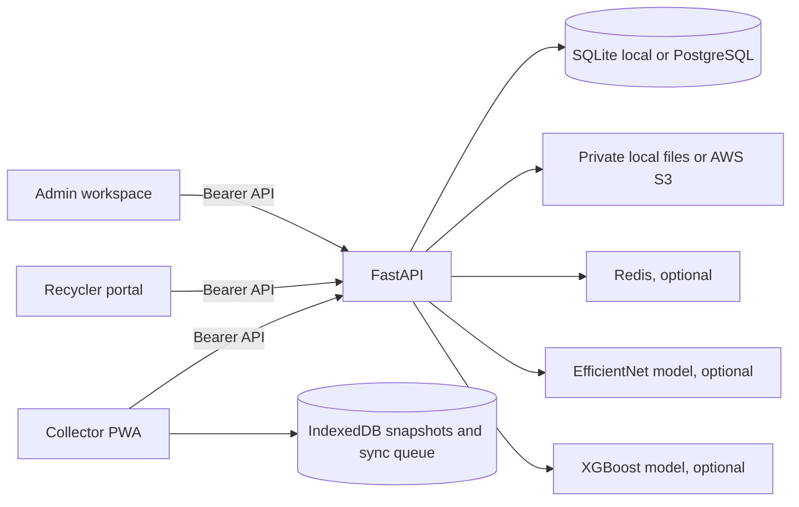

# Kabadiwala Connect

Kabadiwala Connect brings informal e-waste collection into the authorized recycling chain. Collectors can identify and describe an item, review a rate-based estimate, choose a verified recycler, schedule pickup or drop-off, and keep a digital record through handover and payment. Recycler and administrator workspaces manage requests, authorization, rates and data quality.

## Features

- Collector, recycler and administrator accounts with server-enforced roles, hashed passwords, signed revocable sessions and protected records.
- Responsive React PWA with English, Hindi and Marathi labels, speech-to-text notes where the browser supports Web Speech, and camera/gallery item capture.
- E-waste categories for mobile phones, laptops, TVs, batteries, printers and other items, with weight, condition and notes.
- Price board with editable per-kg rates, rate history, condition-adjusted price ranges and source attribution. Starter rates are marked demo data and must be replaced before real use.
- Nearby matching for verified recyclers using accepted material, offers, pickup/drop-off availability and GPS distance; map tiles and directions use OpenStreetMap.
- Lot IDs and QR codes, camera/manual QR scanning, recycler-confirmed material and timestamped handover events.
- Final payment records with method/reference, collector earnings ledger and median/MAD transaction outlier alerts for administrators.
- Offline app shell, IndexedDB snapshots, locally queued collection requests and automatic idempotent sync when a connection returns.
- Admin recycler verification, rate publication, validated image review, image/transaction data exports and network analytics.
- Optional private AWS S3 photo storage, Redis cache and PostgreSQL/PostGIS support. SQLite and local files work without cloud credentials.
- Optional TensorFlow EfficientNet image classifier and XGBoost price model training from reviewed field data. No model weights were supplied, so classification returns a clear unavailable response until a real trained model is provided.

## Technology and architecture



- **Frontend:** React, TypeScript and Vite. The same responsive PWA supports collector and recycler tasks; role-specific navigation exposes administration only to administrators.
- **Backend:** FastAPI with Pydantic validation, SQLAlchemy, revocable bearer sessions, business services and OpenAPI documentation.
- **Database:** SQLite for local setup. Set `DATABASE_URL` to PostgreSQL for deployment. With a PostGIS database and `POSTGIS_ENABLED=true`, distance ranking uses `ST_DistanceSphere`; otherwise it uses Haversine distance.
- **Photos/cache:** Local private files and bounded in-process cache by default; configure S3 and Redis for shared cloud operation.
- **AI/ML:** TensorFlow EfficientNetB0 classification with OpenCV image decoding/resizing; XGBoost can refine price predictions from verified payments. The ordinary price estimate is fully usable from published rate history even without either trained model. A robust median/MAD check flags price outliers after five same-material paid examples.

## Local installation

Use Python 3.11+ and Node.js 20+. Copy `.env.example` to `.env` and set a long random `APP_SECRET`. For the simplest local run keep SQLite, local photo storage and Redis/S3 disabled.

Install and start the backend from the `backend` directory:

```powershell
cd backend
python -m venv .venv
.\.venv\Scripts\Activate.ps1
pip install -r requirements-dev.txt
alembic upgrade head
python -m uvicorn app.main:app --reload --host 127.0.0.1 --port 8000
```

Install and start the frontend in a second terminal:

```powershell
cd frontend
npm install
npm run dev
```

Open [http://localhost:5173](http://localhost:5173). The Vite development server proxies `/api` to `http://127.0.0.1:8000`. API docs are at [http://127.0.0.1:8000/docs](http://127.0.0.1:8000/docs).

The API creates tables on startup; `alembic upgrade head` applies the initial versioned schema. SQLite data and local photos go under the repository `.data` directory.

## Demo accounts

With `APP_ENV=development` and `SEED_DEMO=true`, local startup seeds these accounts. The sign-in page has buttons to fill them.

| Role | Email | Password |
| --- | --- | --- |
| Collector | `collector@demo.kabadwala.local` | `DemoCollector2026!` |
| Recycler | `recycler.green@demo.kabadwala.local` | `DemoRecycler2026!` |
| Administrator | `admin@demo.kabadwala.local` | `DemoAdmin2026!` |

Two additional demo recycler accounts are `recycler.eco@demo.kabadwala.local` and `recycler.clean@demo.kabadwala.local`; both use the recycler password above. The seeded authorization identifiers, rates, addresses and offers are test fixtures, not real regulatory verification or live market data. Disable demo seeding and replace fixture data before deployment.

## Environment variables

`.env.example` documents every setting. Main values:

| Variable | Purpose |
| --- | --- |
| `APP_ENV` | `development`, `test` or `production`. Demo accounts are never seeded in production. |
| `APP_SECRET` | Private signing secret for access tokens. Production requires a non-placeholder value of at least 32 characters. |
| `DATABASE_URL` | SQLAlchemy URL. Local default is SQLite; production can use `postgresql+psycopg://...`. |
| `UPLOAD_DIR` | Private local photo directory; ignored by Git. |
| `ACCESS_TOKEN_HOURS` | Bearer session lifetime. |
| `SEED_DEMO` | Seed local demo users and starter rates outside production. |
| `CORS_ORIGINS` | Comma-separated browser origins allowed by the API. |
| `S3_BUCKET`, `AWS_REGION` | Enable private AWS S3 photo storage. AWS credentials come from the AWS SDK credential chain or the standard access-key variables. |
| `REDIS_URL` | Optional Redis cache URL. Empty uses bounded in-process caching. |
| `POSTGIS_ENABLED` | Enable PostGIS distance calculations for PostgreSQL. The database role needs permission to create/use the extension. |
| `CLASSIFIER_MODEL_PATH` | Path to a trained `model.keras`; `labels.json` must sit beside it. Empty keeps AI classification explicitly unavailable. |
| `PRICE_MODEL_PATH` | Optional trained XGBoost model JSON. Empty uses current rate history. |
| `VITE_API_URL` | Optional frontend API origin; leave blank for the local Vite proxy or same-origin Nginx deployment. |
| `VITE_DEMO_ACCESS` | Set `false` to hide demo-account fill buttons in the frontend. |
| `POSTGRES_DB`, `POSTGRES_USER`, `POSTGRES_PASSWORD` | Docker Compose database name, user and password. Set a private password before starting the Compose stack. |

No API credentials are included. For S3, grant the application identity only the required `s3:PutObject` and `s3:GetObject` access to the configured bucket/prefix; keep public access blocked.

## Database and seed data

- The initial schema is in `backend/migrations/versions/0001_initial_schema.py`; Alembic uses the SQLAlchemy models in `backend/app/models.py`.
- Tables cover users, recycler profiles, historical rates, lots, audit events, payments, classifier feedback, XGBoost training rows and revocable sessions. Foreign keys, uniqueness constraints and indexes protect ownership, lookup and idempotency paths.
- Startup seeds six material rate histories plus a collector, three demo recycler profiles and an administrator when demo seeding is enabled and the database is empty.
- Starter rates are clearly marked as demo data. Administrators can publish a sourced local rate from the price board.

## AI and data preparation

Classification does not return a fabricated prediction. Until a model is configured, the UI reports that the model is unavailable and allows manual material selection.

1. A recycler confirms the material at handover. After payment, an administrator reviews the photo and validates or rejects the label.
2. From the admin Dataset review screen, export validated images. The JSONL contains private server-side image paths, so run training where those files are accessible.
3. Install the optional ML dependencies and train EfficientNetB0. At least five validated photos in each of two material classes are required.

```powershell
cd backend
pip install -r requirements-ml.txt
python scripts/train_classifier.py --manifest path\to\validated-material-images.jsonl --output artifacts\material-classifier --epochs 12
```

Set `CLASSIFIER_MODEL_PATH=artifacts/material-classifier/model.keras` and restart the API. The adjacent `labels.json` is loaded with that model.

To train the optional XGBoost price estimator, export paid transaction rows from the admin Dataset review page and run:

```powershell
cd backend
python scripts/train_value_model.py --manifest path\to\verified-transactions.jsonl --output artifacts\price-model.json
```

At least 20 completed records are required. Set `PRICE_MODEL_PATH=artifacts/price-model.json`. The prediction is bounded against the current market estimate; the published rate board remains the source of truth.

## API documentation

The OpenAPI page at `/docs` is generated by FastAPI. The endpoint and access matrix, request shapes, status codes and authorization behavior are documented in [docs/api.md](docs/api.md).

## Tests and build

```powershell
cd backend
pytest

cd ..\frontend
npm run build
```

Backend tests cover collector registration/sign-in, role enforcement, recycler matching, lot creation, acceptance, handover verification and payment. The optional trained models require actual reviewed image/transaction data and are not part of the test fixtures.

## Deployment

Docker Compose runs a PostGIS PostgreSQL database, Redis, the FastAPI API and an Nginx-served frontend:

```powershell
Copy-Item .env.example .env
# Edit .env: set APP_SECRET and POSTGRES_PASSWORD to private random values.
docker compose up --build -d
```

Open `http://localhost:8080`. For a production host, terminate TLS at the ingress/load balancer, set `APP_ENV=production`, `SEED_DEMO=false`, a strict `CORS_ORIGINS`, private database credentials and a persistent volume for local photos (or configure S3). The API image runs `alembic upgrade head` before serving. Keep Redis and PostgreSQL private to the application network. Use a secrets manager or workload identity for AWS credentials; never commit `.env`.

## Troubleshooting

- **Login says the account is unavailable:** check that the API is running and `SEED_DEMO=true` is set for a fresh local database. Demo seeds are added only to an empty database.
- **Frontend cannot reach the API:** verify port 8000 is listening and restart Vite so its `/api` proxy settings reload.
- **Photos fail to save:** confirm `.data` is writable, or check S3 bucket, region and IAM permissions when S3 is configured.
- **Nearby list has no results:** only verified recyclers with the chosen material and collection mode are shown. Demo recycler coordinates are around Pune; grant browser location access or use the directory list without GPS ranking.
- **Map background is blank:** OpenStreetMap tiles need internet. The verified partner list and distance calculations remain available from cached/local data.
- **Image identification is unavailable:** configure a trained model and the optional TensorFlow/OpenCV dependencies. The application keeps manual material selection available.
- **Model training reports too few examples:** complete and pay for real lots, confirm material at handover, validate enough distinct images in the admin queue, then export again.
- **Production startup rejects the secret:** set `APP_SECRET` to a private random string, not the development fallback.

## Project structure

```text
.
|-- backend/
|   |-- app/
|   |   |-- services/
|   |   |   |-- __init__.py
|   |   |   |-- classification.py
|   |   |   |-- lots.py
|   |   |   `-- pricing.py
|   |   |-- __init__.py
|   |   |-- cache_layer.py
|   |   |-- config.py
|   |   |-- database.py
|   |   |-- main.py
|   |   |-- models.py
|   |   |-- object_storage.py
|   |   |-- schemas.py
|   |   |-- seed.py
|   |   `-- security.py
|   |-- migrations/
|   |   |-- versions/
|   |   |   `-- 0001_initial_schema.py
|   |   |-- env.py
|   |   `-- script.py.mako
|   |-- ml/
|   |   |-- __init__.py
|   |   `-- features.py
|   |-- scripts/
|   |   |-- train_classifier.py
|   |   `-- train_value_model.py
|   |-- tests/
|   |   |-- conftest.py
|   |   `-- test_api.py
|   |-- alembic.ini
|   |-- Dockerfile
|   |-- requirements-dev.txt
|   |-- requirements-ml.txt
|   `-- requirements.txt
|-- docs/
|   |-- api.md
|   `-- requirements.md
|-- frontend/
|   |-- public/
|   |   |-- manifest.webmanifest
|   |   `-- sw.js
|   |-- src/
|   |   |-- components/
|   |   |   |-- Layout.tsx
|   |   |   |-- QRScanner.tsx
|   |   |   |-- RecyclerMap.tsx
|   |   |   `-- ui.tsx
|   |   |-- pages/
|   |   |   |-- AdminRecyclersPage.tsx
|   |   |   |-- AnomaliesPage.tsx
|   |   |   |-- AuthPage.tsx
|   |   |   |-- DashboardPage.tsx
|   |   |   |-- DataReviewPage.tsx
|   |   |   |-- LotDetailPage.tsx
|   |   |   |-- LotsPage.tsx
|   |   |   |-- NewLotPage.tsx
|   |   |   |-- PricesPage.tsx
|   |   |   |-- RecyclerProfilePage.tsx
|   |   |   |-- RecyclersPage.tsx
|   |   |   `-- SafetyPage.tsx
|   |   |-- App.tsx
|   |   |-- api.ts
|   |   |-- auth.tsx
|   |   |-- i18n.ts
|   |   |-- main.tsx
|   |   |-- storage.ts
|   |   |-- styles.css
|   |   |-- types.ts
|   |   `-- vite-env.d.ts
|   |-- Dockerfile
|   |-- index.html
|   |-- nginx.conf
|   |-- package-lock.json
|   |-- package.json
|   |-- tsconfig.json
|   `-- vite.config.ts
|-- .env.example
|-- .gitignore
|-- docker-compose.yml
`-- README.md
```
# Kabadiwala

